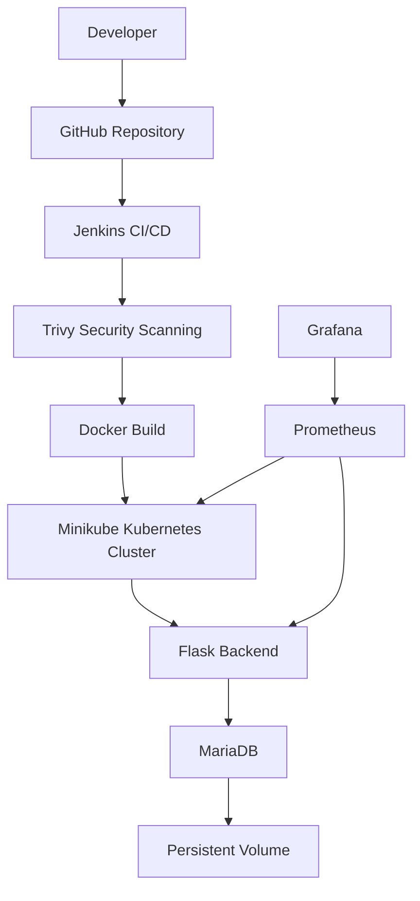
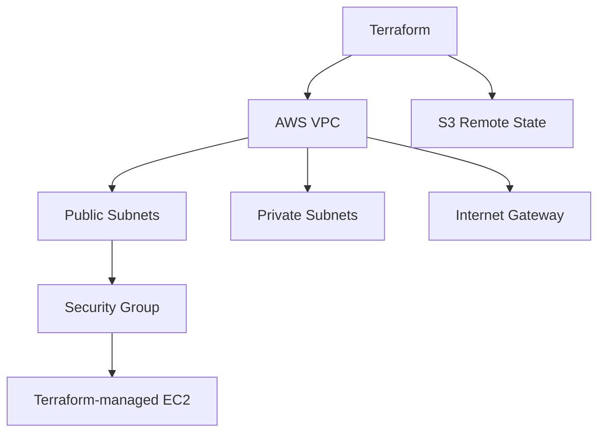

# CloudCart — End-to-End DevOps Project

CloudCart is a production-style DevOps portfolio project built to demonstrate an end-to-end software delivery workflow using AWS, Docker, Jenkins, Kubernetes, Terraform, monitoring, and DevSecOps practices.

The application is a lightweight e-commerce backend built with Flask and MariaDB. The main focus of the project is not application development, but designing, automating, deploying, monitoring, securing, and troubleshooting the application using modern DevOps tools.

---

## Project Objectives

CloudCart was built to demonstrate practical experience with:

- Linux and Git-based development workflows
- Docker containerization
- Docker Compose
- Jenkins CI/CD pipelines
- Kubernetes deployments
- Persistent database storage
- Application health checks
- Prometheus and Grafana monitoring
- AWS infrastructure provisioning with Terraform
- Terraform remote state management
- Reusable Terraform modules
- DevSecOps security scanning with Trivy
- Container and Kubernetes security hardening
- Rolling deployments and rollback
- Real-world DevOps troubleshooting

---

## Architecture



### AWS Infrastructure as Code

Terraform is maintained as a separate Infrastructure-as-Code component of the project.



> **Important:** The CloudCart application currently runs on Minikube hosted on the original DevOps EC2 instance. The Terraform-managed AWS infrastructure is a separate IaC implementation used to demonstrate automated infrastructure provisioning. Terraform does not provision the existing Jenkins/Minikube host.

---

## Technology Stack

| Area | Technology |
|---|---|
| Application | Python, Flask |
| Database | MariaDB |
| Source Control | Git, GitHub |
| Containerization | Docker |
| Multi-container Development | Docker Compose |
| CI/CD | Jenkins |
| Container Orchestration | Kubernetes / Minikube |
| Infrastructure as Code | Terraform |
| Cloud | AWS |
| Monitoring | Prometheus, Grafana |
| Security Scanning | Trivy |
| Operating System | Amazon Linux 2023 |
| Scripting | Shell |

---

## Repository Structure

```text
Cloud-Cart/
│
├── app/
│   ├── backend/
│   │   ├── app.py
│   │   ├── Dockerfile
│   │   └── requirements.txt
│   │
│   └── database/
│       └── init.sql
│
├── docker/
│   └── docker-compose.yml
│
├── jenkins/
│   └── Jenkinsfile
│
├── kubernetes/
│   ├── backend-deployment.yaml
│   ├── backend-service.yaml
│   ├── database-configmap.yaml
│   ├── database-deployment.yaml
│   ├── database-pvc.yaml
│   └── database-service.yaml
│
├── monitoring/
│   ├── prometheus-values.yaml
│   └── grafana-values.yaml
│
├── terraform/
│   ├── backend-bootstrap/
│   ├── modules/
│   │   ├── compute/
│   │   └── network/
│   ├── backend.hcl.example
│   ├── main.tf
│   ├── moved.tf
│   ├── outputs.tf
│   ├── provider.tf
│   ├── variables.tf
│   └── versions.tf
│
├── docs/
├── scripts/
├── .gitignore
└── README.md
```

---

## Application

The CloudCart Flask backend provides endpoints including:

```text
GET /
GET /health
GET /products
```

The `/health` endpoint is used by Kubernetes probes and CI/CD validation.

The `/products` endpoint retrieves product information from MariaDB.

Example product data includes:

```text
Laptop
Mouse
Keyboard
```

---

## Docker

The Flask application is containerized using Docker.

The backend container was later hardened to:

- Run as a non-root user
- Use Python 3.12 slim
- Avoid unnecessary Python cache files
- Use a non-root UID
- Support a read-only root filesystem
- Minimize unnecessary packages

Docker Compose is also included to demonstrate multi-container orchestration between the Flask backend and MariaDB database.

---

## Jenkins CI/CD Pipeline

The Jenkins pipeline automates the complete application delivery workflow.

```text
GitHub
   ↓
Jenkins Checkout
   ↓
Security Scanning
   ↓
Docker Image Build
   ↓
Application Tests
   ↓
Load Image into Minikube
   ↓
Kubernetes Deployment
   ↓
Rollout Verification
   ↓
Health Check
   ↓
Products API Test
```

Each Jenkins build creates a unique Docker image tag based on the Jenkins build number.

Example:

```text
cloudcart-backend:17
```

This provides traceability between a Jenkins build and the application version deployed to Kubernetes.

---

## DevSecOps

Trivy is integrated into the Jenkins CI/CD pipeline.

Security checks include:

### Secret Scanning

The repository is scanned for accidentally committed secrets.

### Dependency Scanning

Python dependencies are scanned for HIGH and CRITICAL vulnerabilities.

### Container Image Scanning

Docker images are scanned before deployment.

During implementation, the original Python base image contained multiple operating-system vulnerabilities.

The backend was upgraded from Python 3.9 to Python 3.12 and rebuilt using a newer base image.

After remediation, there were:

```text
0 actionable HIGH/CRITICAL vulnerabilities
```

when ignoring vulnerabilities without upstream fixes.

### Kubernetes Security Scanning

The backend Kubernetes manifest was scanned for security misconfigurations.

The backend was hardened using:

```text
runAsNonRoot
readOnlyRootFilesystem
allowPrivilegeEscalation: false
capabilities: drop ALL
seccompProfile: RuntimeDefault
```

The hardened backend manifest produced:

```text
0 HIGH/CRITICAL Trivy Kubernetes misconfigurations
```

### Terraform Security Audit

Terraform configuration is also scanned using Trivy.

Some findings are intentionally accepted for the lab environment and documented as production improvements rather than adding unnecessary cost or complexity.

---

## Kubernetes

CloudCart runs on Kubernetes using Minikube.

The Kubernetes environment includes:

```text
Flask Backend Deployment
Backend NodePort Service
MariaDB Deployment
MariaDB ClusterIP Service
Database ConfigMap
Database PersistentVolumeClaim
Kubernetes Secrets
Readiness Probes
Liveness Probes
CPU/Memory Resource Controls
```

### Database Persistence

MariaDB uses persistent storage through a Kubernetes PVC.

This allows database data to survive pod restarts and application redeployments.

Persistence is different from backup: a PVC protects data from normal pod recreation, while a production system would also require scheduled backups and tested restore procedures.

---

## Rolling Deployment and Rollback

Kubernetes rolling deployments were tested as part of the project.

The backend was successfully upgraded between Jenkins-generated image versions without application downtime.

Rollback was also tested using Kubernetes Deployment history.

Example workflow:

```bash
kubectl rollout history deployment/cloudcart-backend

kubectl rollout undo deployment/cloudcart-backend --to-revision=<revision>

kubectl rollout status deployment/cloudcart-backend
```

After rollback, both `/health` and `/products` were verified successfully.

The latest application release was then restored.

---

## Monitoring

CloudCart includes Kubernetes monitoring using:

```text
Prometheus
Grafana
kube-state-metrics
node-exporter
metrics-server
```

Prometheus collects application and infrastructure metrics.

Grafana provides dashboards for visualizing the collected metrics.

Persistent storage is configured for monitoring components so monitoring data can survive pod recreation.

---

## Terraform Infrastructure

Terraform is used to provision AWS infrastructure using Infrastructure as Code.

The implementation includes:

```text
Custom VPC
Two Public Subnets
Two Private Subnets
Internet Gateway
Route Tables
Security Groups
EC2 Instance
Encrypted EBS Storage
IMDSv2
Terraform Outputs
Reusable Network Module
Reusable Compute Module
```

The private subnets intentionally do not use a NAT Gateway in this lab environment to avoid unnecessary AWS cost.

---

## Terraform Remote State

Terraform state is stored remotely in Amazon S3.

The backend includes:

```text
S3 remote state
Bucket versioning
Server-side encryption
Public access blocking
Terraform state locking
```

Terraform uses an S3 lock file rather than DynamoDB for state locking.

Sensitive environment-specific values are excluded from Git using `.gitignore`.

---

## Terraform Modules

The Terraform configuration was refactored into reusable modules:

```text
modules/network
modules/compute
```

Existing Terraform-managed resources were moved into modules using Terraform `moved` blocks.

The refactoring was validated with:

```text
0 resources added
0 resources changed
0 resources destroyed
```

This allowed the Terraform structure to be improved without recreating the existing AWS infrastructure.

---

## Git Workflow

CloudCart was developed using multiple branches, including:

```text
main
develop
feature/repository-setup
feature/application-skeleton
feature/terraform-infrastructure
feature/final-integration
feature/devsecops
```

Feature work was committed separately and later promoted into the final `main` branch through GitHub pull requests.

---

## Key Troubleshooting Experience

The project intentionally provided several real-world troubleshooting scenarios, including:

- GitHub SSH authentication issues
- Missing Python `pip` packages on Amazon Linux
- MariaDB SQL file path problems
- EC2 insufficient capacity errors
- Jenkins Docker permissions
- Jenkins Kubernetes authentication
- Missing Jenkins kubeconfig causing `kubectl` to connect to Jenkins on localhost:8080
- Minikube resource constraints
- Kubernetes pod startup and readiness issues
- Terraform AWS authentication
- Terraform AMI drift causing unexpected EC2 replacement
- Terraform S3 backend IAM permission errors
- Terraform state locking permissions
- Terraform module refactoring issues
- Trivy repository configuration errors
- Container vulnerability remediation
- Kubernetes security hardening
- Kubernetes rolling deployment and rollback testing

These scenarios were investigated by identifying the symptom, finding the root cause, applying a fix, and validating the result.

---

## Production Improvements

The current environment is designed as a cost-conscious DevOps lab.

For a real production implementation, the architecture could be extended with:

```text
AWS Application Load Balancer / Kubernetes Ingress
HTTPS with ACM certificates
Amazon ECR
Amazon EKS
Multi-node and Multi-AZ Kubernetes
Amazon RDS / managed database
AWS Secrets Manager
AWS KMS
Private application and database subnets
Automated database backups
Centralized application logging
Alertmanager and production alerts
Stricter IAM least privilege
High availability and autoscaling
```

These were intentionally not implemented because the goal of CloudCart is to demonstrate the core DevOps lifecycle while keeping AWS cost and infrastructure complexity manageable.

---

## What This Project Demonstrates

CloudCart demonstrates an end-to-end DevOps workflow:

```text
CODE
 ↓
GIT
 ↓
CI/CD
 ↓
SECURITY
 ↓
CONTAINER
 ↓
KUBERNETES
 ↓
MONITORING
 ↓
INFRASTRUCTURE AS CODE
 ↓
PRODUCTION READINESS
```

The project focuses not only on successfully deploying an application, but also on understanding how the individual DevOps components work together and how to troubleshoot failures throughout the delivery lifecycle.

---

## Project Status

Core CloudCart DevOps implementation: **Completed**

Implemented:

```text
Application
Git & GitHub
Docker
Docker Compose
Jenkins CI/CD
Kubernetes
Persistent Storage
Monitoring
Terraform
Remote Terraform State
Terraform Modules
Jenkins → Kubernetes Integration
Trivy DevSecOps
Container Hardening
Kubernetes Hardening
Rolling Deployment
Rollback Testing
Production Readiness Review
```

Code-quality analysis using SonarQube/SonarCloud is being treated as an optional extension and does not block completion of the core project.
